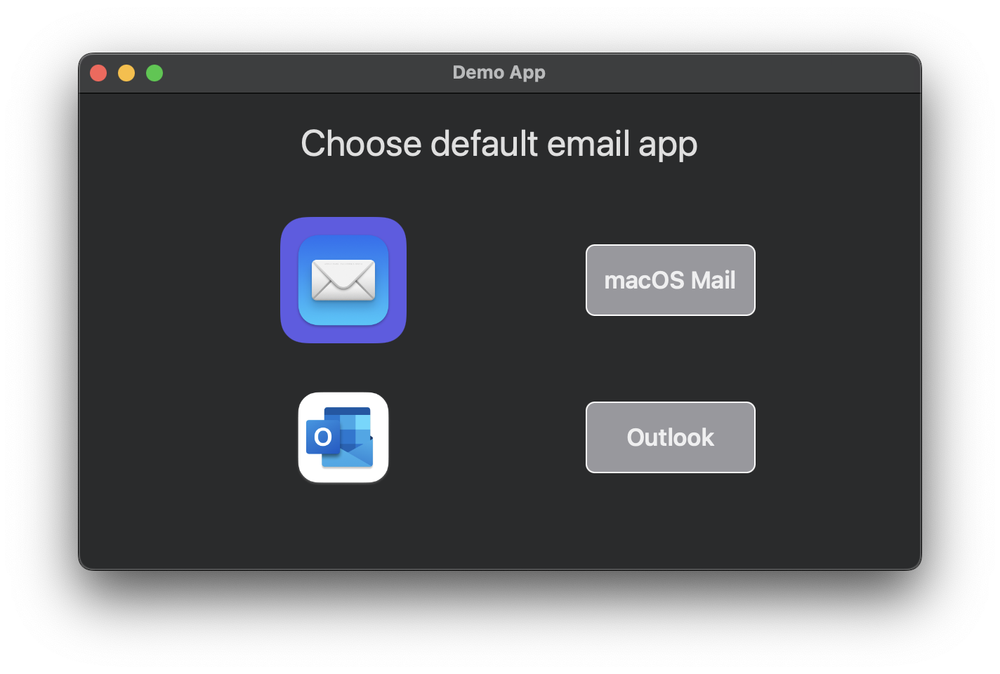

# Scripting with SwiftUI Demo

*Scripting with SwiftUI* demo for FinMacAdmin meetup 13.04.2022. 

This is a sequel for 2019 FinMacAdmin [Scripting in Swift](https://github.com/jlehikoinen/ScriptingInSwiftDemo) presentation.

SwiftUI scripts are located in the `Scripts` folder. `DefaultMailApp.swift` script can be used for setting up default email application (macOS Mail or MS Outlook). Try `DefaultMailAppOnlyUI.swift` script if you want test the UI only.

This repo contains also SwiftUI Xcode project `ScriptingWithSwiftUIDemo` that can be used for e.g. live previewing SwiftUI code.

## Requirements

* Xcode 13
* Xcode Command Line Tools

## Setup

Install Xcode Command Line Tools.

> Tip: Install Xcode Command Line Tools by running `swift` in Terminal app.

Install Xcode if you want to live preview SwiftUI code.

Download or `git clone` this repo.

## Usage

GUI example (button functionality disabled):

`$ ./DefaultMailAppOnlyUI.swift`

Choose default email app example:

`$ ./DefaultMailApp.swift`

Empty window example:

`$ ./EmptyWindow.swift`

## Default email app



## Default email app configuration

`DefaultMailApp.swift` uses Launch Services API for changing default email application. See details below.

Apple documentation: https://developer.apple.com/documentation/coreservices/launch_services

macOS Mail Launch Services handlers:

```
com.apple.mail.email:   com.apple.mail
public.vcard:           com.apple.AddressBook
com.apple.ical.ics:     com.apple.CalendarFileHandler
```

MS Outlook Launch Services handlers:

```
com.apple.mail.email:                   com.microsoft.outlook
com.microsoft.outlook16.email-message:  com.microsoft.outlook
public.vcard:                           com.microsoft.outlook
com.apple.ical.ics:                     com.microsoft.outlook
com.microsoft.outlook16.icalendar:      com.microsoft.outlook
```

macOS Mail URL Scheme:

```
mailto: com.apple.mail
```

MS Outlook URL Scheme:

```
mailto: com.microsoft.outlook
```

## Additional information

* Menu bar displays the active app name as "swift-frontend" in GUI scripts
* Scripts have been tested only on macOS 12
* Code related to SwiftUI animations can output `CVCGDisplayLink` warning messages to console

## Todo

* How to implement [CommandMenu](https://developer.apple.com/documentation/swiftui/commandmenu) in SwiftUI scripts?